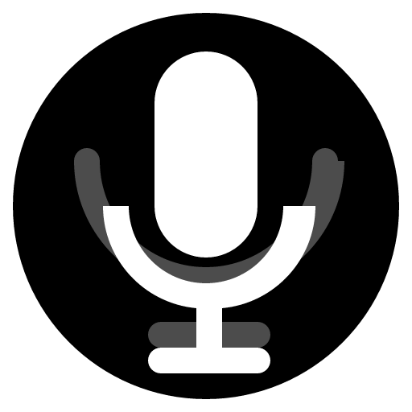

# 🎙️ Notlok

**Real-time audio transcription app powered by Whisper AI**

[](https://opensource.org/licenses/MIT)
[](https://github.com/unkownpr/Notlok/releases)
[](https://github.com/unkownpr/Notlok/actions)
[](https://github.com/unkownpr/Notlok)

Notlok is a **free and open-source** cross-platform desktop application that provides real-time audio transcription with support for multiple languages, AI-powered meeting summaries, and advanced audio device management.

<div align="center">
  
</div>

> **🎉 NOW OPEN SOURCE!**  
> Notlok is now completely free and open-source under the MIT License.  
> Use, modify, and distribute freely - no restrictions!

## ✨ Features

- 🎯 **Real-time Transcription** - Live audio transcription using Whisper AI
- 🌍 **Multi-language Support** - Turkish, English, and auto-detection
- 🎤 **Advanced Audio Capture** - Both microphone and system audio
- 🔊 **Device Selection** - Choose your preferred input/output devices
- 🤖 **AI Reports** - Generate meeting summaries with Notlok AI or Gemini
- 📝 **Recording History** - Save and review past transcriptions
- 🔄 **Auto-updates** - Seamless update system
- 🎨 **Theme Support** - Light, dark, and system themes
- 🆓 **Completely Free** - No license keys, no subscriptions
- 🌐 **Open Source** - MIT Licensed, fork and modify as you wish!

## 🎉 Why Open Source?

We believe in the power of community and open collaboration! By open-sourcing Notlok, we aim to:

- 📚 **Empower Developers** - Learn from real-world Tauri + Rust + React code
- 🤝 **Build Together** - Community-driven improvements and features
- 🌍 **Accessibility** - Make AI transcription available to everyone, everywhere
- 🔒 **Transparency** - See exactly how your audio data is processed (locally!)
- 💡 **Innovation** - Enable others to build upon and improve the foundation

**Privacy First**: All transcription happens locally on your device. No cloud processing, no data collection.

## 🚀 Quick Start

### Prerequisites

- macOS 13.0+ (Apple Silicon M1/M2/M3/M4)
- Windows 10/11 (64-bit)
- Microphone and/or system audio access

### Installation

1. Download the latest release from [Releases](https://github.com/unkownpr/Notlok/releases)
2. Install the app:
   - **macOS**: Open the `.dmg` file and drag to Applications
   - **Windows**: Run the `.msi` installer
3. Launch Notlok
4. *(Optional)* Enter your API keys for AI features (Notlok AI / Gemini)
5. Grant microphone and screen recording permissions
6. Download your preferred Whisper model
7. Start recording! 🎉

**No license key required - completely free!** 🎉

## 🛠️ Development

### Setup

```bash
# Clone the repository
git clone https://github.com/unkownpr/Notlok.git
cd Notlok

# Install dependencies
npm install

# Run in development mode
npm run tauri dev
```

### Build

```bash
# Build for your current platform
npm run tauri build

# For multi-platform builds, see GITHUB_ACTIONS_GUIDE.md
```

## 📦 Project Structure

```
notlok/
├── src/                    # React frontend
│   ├── App.tsx            # Main application
│   ├── App.css            # Styles
│   └── utils/             # Utilities
├── src-tauri/             # Rust backend
│   ├── src/
│   │   ├── audio_capture/ # Audio recording
│   │   ├── transcription/ # Whisper integration
│   │   └── lib.rs         # Main Tauri code
│   └── swift/             # macOS Swift code
└── .github/workflows/     # CI/CD automation
```

## 🛠️ Tech Stack

- **Frontend**: React 18 + TypeScript + Vite
- **Backend**: Rust (Tauri 2.x)
- **Audio Processing**: Whisper.cpp, Parakeet TDT
- **macOS Integration**: Swift (ScreenCaptureKit, AVFoundation)
- **AI Integration**: Gemini API, Custom AI API
- **Build System**: GitHub Actions (Multi-platform CI/CD)
- **UI/UX**: Custom CSS with Dark/Light theme support

## 🗺️ Roadmap

- [x] Real-time transcription
- [x] Multi-language support
- [x] AI meeting summaries
- [x] Auto-update system
- [x] Open source release! 🎉
- [ ] Linux support
- [ ] More language models (Distil-Whisper, Faster-Whisper)
- [ ] Custom vocabulary support
- [ ] Real-time translation
- [ ] Plugins/Extensions system
- [ ] Mobile companion app

**Want to contribute?** Check the [Issues](https://github.com/unkownpr/Notlok/issues) page!

## 🤝 Contributing

We welcome contributions from the community! Here's how you can help:

### Ways to Contribute

- 🐛 **Report bugs** - Open an issue with details
- 💡 **Suggest features** - Share your ideas
- 🔧 **Submit PRs** - Fix bugs or add features
- 📖 **Improve docs** - Help others understand Notlok
- 🌍 **Translations** - Add new languages
- ⭐ **Star the repo** - Show your support!

### Development Workflow

1. Fork the repository
2. Create a feature branch (`git checkout -b feature/amazing-feature`)
3. Commit your changes (`git commit -m 'Add amazing feature'`)
4. Push to your branch (`git push origin feature/amazing-feature`)
5. Open a Pull Request

## 📄 License

**MIT License - Completely Free & Open Source! 🎉**

Notlok is now open-source software licensed under the MIT License. You are free to:

- ✅ Use the software for any purpose (personal or commercial)
- ✅ Modify the source code
- ✅ Distribute copies
- ✅ Create derivative works
- ✅ Use in commercial products
- ✅ Private use

See the [LICENSE](LICENSE) file for full details.

**No license keys, no subscriptions, no restrictions - just pure open source!**

## 🔗 Links

- **GitHub**: [github.com/unkownpr/Notlok](https://github.com/unkownpr/Notlok)
- **Issues**: [Report a Bug](https://github.com/unkownpr/Notlok/issues)
- **Releases**: [Download Latest](https://github.com/unkownpr/Notlok/releases)
- **Developer**: [ssilistre.dev](https://ssilistre.dev)

## ⭐ Star History

If you find Notlok useful, please consider giving it a star on GitHub! It helps others discover the project.

[](https://star-history.com/#unkownpr/Notlok&Date)

## 🙏 Acknowledgments

- [Whisper AI](https://github.com/openai/whisper) - Speech recognition
- [Tauri](https://tauri.app/) - Desktop app framework
- [React](https://react.dev/) - UI framework

---

Made with ❤️ by [ssilistre.dev](https://ssilistre.dev)
